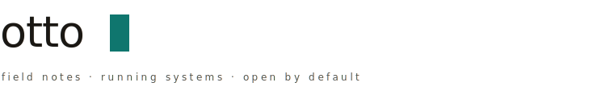
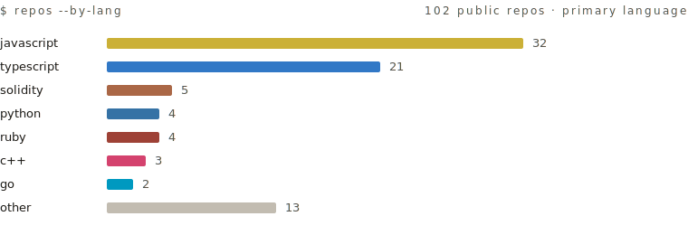

<picture>
  <source media="(prefers-color-scheme: dark)" srcset="assets/header-dark.svg">
  
</picture>

Curious dev. Right now: agent systems and tooling. Before that: payments, ZK, DAOs.
Most of what I write is open source.

### now

**[swipepad](https://swipepad.xyz)** · swipe to donate crypto, live on celo\
**[digipaga](https://digipaga.com)** · essential-service payments in LATAM, settled in stablecoins\
**model plane** · a gateway that routes AI calls across providers · not public yet\
**omnix** · my homelab as declarative nixos, multi-host, reproducible

<code>$ git log --reverse</code>&nbsp; 2016 → now

 

`2016` created this account for a hackathon in barcelona. i'd been writing code long before\
`2017` [geth network-status plugin](https://github.com/ottodevs/mustekala) in go · first solidity contracts\
`2018` founding team at autark · [open enterprise](https://github.com/AutarkLabs/open-enterprise), a DAO suite on aragon mainnet\
`2018` taught a blockchain master's course for seven years\
`2022` hackathons become routine · 30+ since\
`2023` leology, the first testing framework for aleo · devconnect istanbul\
`2025` [zkpoker](https://github.com/ottodevs/zkpoker) at ethglobal trifecta · [pool](https://poolparty.cc) goes live · swipepad and digipaga follow\
`2026` building a fleet of self-hosted agents. early stage

<code>$ ls ~/toolbox</code>

 

`daily` typescript · python · nix · solidity\
`before` c++ · qt · java · go · ruby · matlab · processing\
`learning` rust\
`domains` evm contracts · zk circuits · llm routing · agent runtimes · declarative infra · native apps on linux, macos, windows\
`misc` gpu bios mods, back in the mining days

  <picture>
    <source media="(prefers-color-scheme: dark)" srcset="assets/langs-dark.svg">
    
  </picture>

### notes

Old cypherpunk habits: I self-host my infrastructure and default to open source.
The long version is at [otto.institute](https://otto.institute), or just ask.

the agent fleet still breaks more than I'd like.
